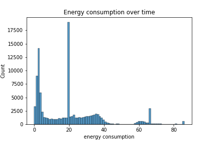
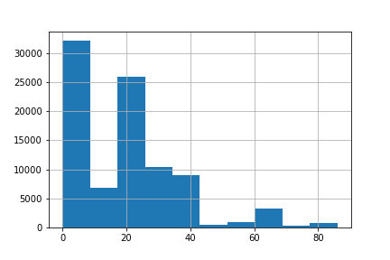
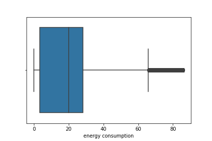
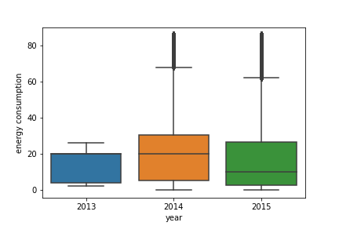
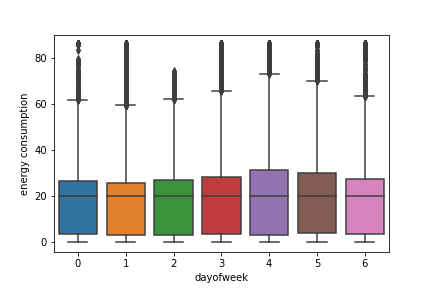
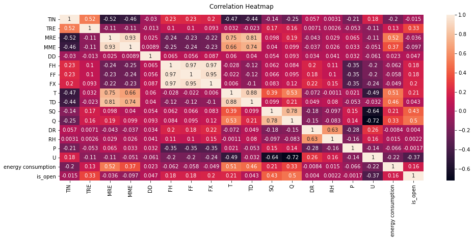

# Energy Consumption Assignment: Report

## EDA

* The boxplot indicates the energy consumption data is right-skewed and values over 65 are outliers. 
* Boxplots grouped by year shows that the same trend happens for energy consumption data in 2015 (37.46 % of dataset). Energy consumption in 2014 (57.57 % of dataset) is different though: little left-skewed and outliers are values that are over 70. Also, energy consumption in 2014 is generally higher than 2013 and 2015.
* Boxplots grouped by day of week shows that the energy consumption is relatively the same every day of the week
* Correlation heatmap: [('MRE', 'MME'), ('FH', 'FF'), ('FH', 'FX'), ('FF', 'FX')] are the pairs that have linear correlation over 0.9 (highly correlated)

## Data Preprocessing
#### 1. Handling missing null values:
* Sample Time 1 (3): drop nulls (only 3)
* TIN (3): replace by median
* TRE (34): replace by median
* MRE (34): replace by median
* MME (105): replace by median
* N (36): replace by mode (since it indicates how clear the sky is)
* energy consumption (44): replace by median

#### 2. Extract features from time series data
From the column 'Sample Time 1' which says the date-time, create following new columns:
* year, month, dayofweek
* is_weekend: if the time is weekend or not
* is_open: if the building is open or not at that time

#### 3. Make dummy variables:
* Transform N to categorical variables; all the columns extracted from 'Sample Time 1' is also categorical
* Make dummy variables from them: 19 to 51 columns in total

## Prediction Model
* I tried different regression models namely Lasso, Ridge, Random Forest Regression to predict energy consumption, using linear regression as baseline model. Then I used **GridSearchCV** to tune each model, and evaluated performance of each model based on **MAE and R2**. 

## Anomaly Detection
* I used **Isolation Forest** to detect outliers. The result is: **6751 outliers (versus 60747 'normal' data)** when the model is *iso = IsolationForest(n_estimators=100, max_samples='auto', contamination=float(0.1),max_features=1.0)*. When the contamination is changed to 0.01, the number of outliers reduces to **673 (versus 66824 'normal' data)**

## Result

#### 1. Prediction Model
* MAE of LR:  8.11
* MAE of Lasso:  8.35
* MAE of Ridge:  8.13
* MAE of Random Forest:  0.67
* R2 of LR:  0.56
* R2 of Lasso:  0.54
* R2 of Ridge:  0.56
* R2 of Random Forest:  0.98

Therefore, to predict energy consumption, **Random Forest** is the best model with lowest MAE and highest R2.

#### 2. Anomaly Detection 
iso = IsolationForest(n_estimators=100, max_samples='auto', contamination=float(0.1),max_features=1.0)
